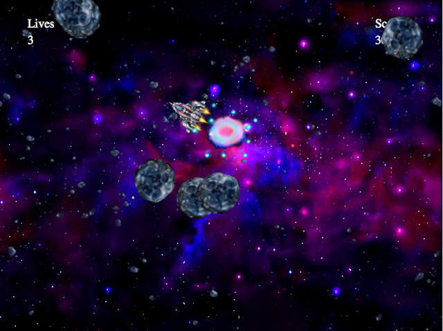

py-RiceRocks
============================

Simple implementation of classic arcade game Asteroids made in Python.
This was the Mini-project #8 for the course "An Introduction to Interactive Programming in Python"
done in Coursera by Rice university

How To Get Started
==================

This Python implementation need to run on [codeskulptor.org](http://www.codeskulptor.org). 
- Copy the code from **py-RiceRocks.py**
- Paste the code inside [codeskulptor.org](http://www.codeskulptor.org)
- Press the play button.
- Enjoy :)

License 
---------
py-RiceRocks is available under the MIT license. See the LICENSE file for more info.

**Follow me on twitter [@capezzbr](http://www.twitter.com/capezzbr)**
